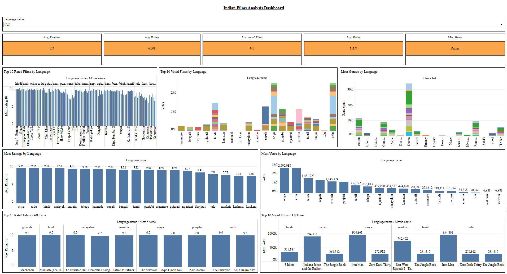

# Indian Movie Data Analysis with SQL Server and Tableau

This project analyzes a dataset of Indian movies using SQL Server for data cleaning, normalization, and querying, followed by data visualization with Tableau.

## Project Overview

This project demonstrates proficiency in:
* **SQL Server:** For data manipulation, cleaning, normalization, and complex querying.
* **Data Analysis:** Extracting insights from data through SQL server.
* **Data Visualization:** Creating Interactive dashboards using Tableau Public.

## Dataset

The dataset used in this project is the "Indian Movies" dataset from Kaggle. [https://www.kaggle.com/datasets/nareshbhat/indian-moviesimdb]

### Data Cleaning and Transformation:

The original "IndianMovies" table likely contained redundant information and inconsistencies. I have addressed these issues by:
* Splitting multi-valued columns (e.g., Genre) into separate tables.
* Creating new tables to group related data (e.g., Genres, Languages).
* Establishing relationships between tables using foreign keys.
* Removing duplicate data.
* Setting primary keys for each table.
* Cleaning and transforming data for consistency.
* Data Cleaning and Normalization Steps

You can find the queries I have used in the "Indian Movies Dataset cleaning.sql" File.
https://github.com/paruchurisai99/IndianMovieAnalysis/blob/0ffbc9d1739f57c3883e93d49f44eca0d574c980/SQL%20Queries/Indian%20Movies%20Dataset%20cleaning%20and%20Transformation.sql

### Data Exploration and Analysis: 

After cleaning and transforming the data, several queries were executed to explore the dataset and extract meaningful insights. Some of the queries answered are:

* Top 10 Rating Films based on Language?
* Top 10 Genres in the movies list?
* Top 10 Genres according to the languages?
* Top 10 Votes in the movies list?
* Top 10 Votes according to the languages?
* How many films are in each language in this dataset?
* What are the most genres in each language films (What language does what genres maximum)
* How many films have been released over the years?
* Which films got the highest Rating?
* Which films got the highest votes?
* Which language films got the highest Rating?
* Which language films got the highest Votes?
* What is the average run time acc. based on the Languages?
* Which films got the highest rating and votes?
* What is the average runtime for the films?
* What is the average number of films released in a year?

You can find the queries I have used in the "Indian Movies Data Exploration.sql" File. https://github.com/paruchurisai99/IndianMovieAnalysis/blob/0ce84b2190ac6dcf422652bfcb6434e82ee4b2a6/SQL%20Queries/Indian%20Movies%20Data%20Exploration%20and%20Analysis.sql

## Data Visualization (Tableau)

The results of each of these SQL queries were exported to Excel files. These Excel files were then imported into Tableau Public to create an Interactive Dashboard as below:

[https://public.tableau.com/app/profile/sai.paruchuri/viz/IndianFilmsAnalysis_Sample/Dashboard2]

